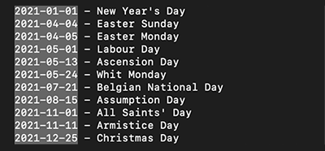
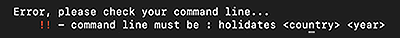

# nodeJs-CLI : holidates

With this package you will be able to check the national holidays of any country you want. You will have to install it through npm and run a simple command line to make it work. Please feel free to contact me if there's any issue with the package.

## Download 

`npm i @sandrinle/holidates`

## Tools and Languages
* NodeJs
* npm

__Packages__

* Country list
* Axios
* Figlet
* Chalk

## How to use it

Once you have installed the package, in the command terminal you'll have to use this line :

`holidates <country> <year>`

Eg : holidates Belgium 2021

If there's an error, you'll see this message

Thank you for your time ! 